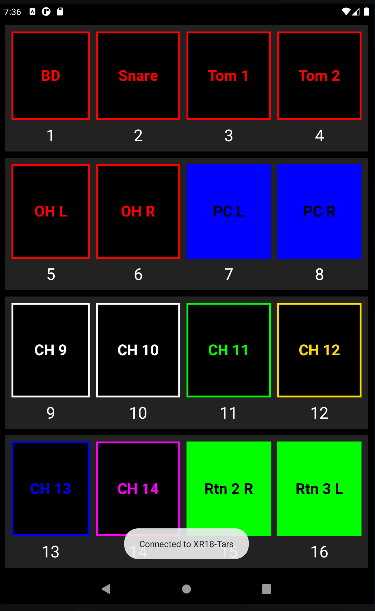

# Ultranet Scribble Strip

A very basic Android app which connects to an XR18 Behringer digital mixer on the network.
It shows the scribble strips (name and color) of the channels that are selected for Ultranet.

This is particularly useful when combining a Behringer P16 personal monitor mixer with the XR18 digital mixer.
The P16 doesn't show the names of the channels and this app can be used to quickly see which channel is which instrument.

* [Behringer XR18](https://www.behringer.com/product.html?modelCode=0605-AAD)
* [Behringer P16](https://www.behringer.com/behringer/product?modelCode=0609-AAB)

[Download the APK](https://android.t-ars.be/UltranetScribbleStrip.apk)